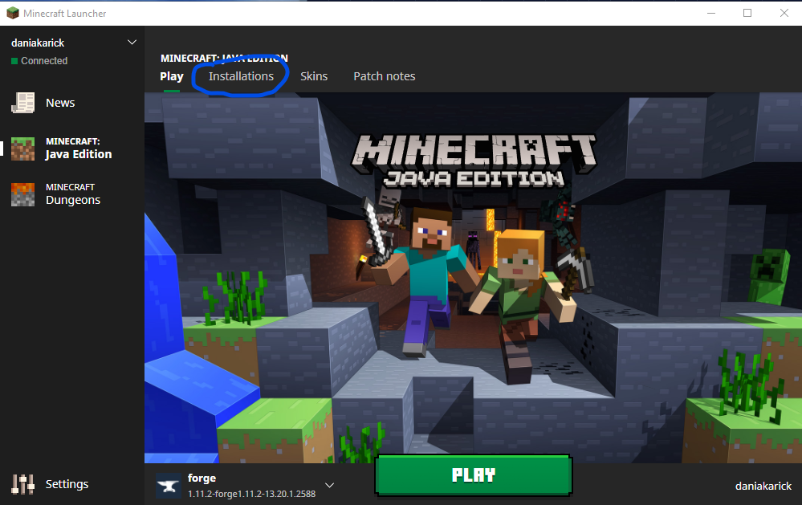
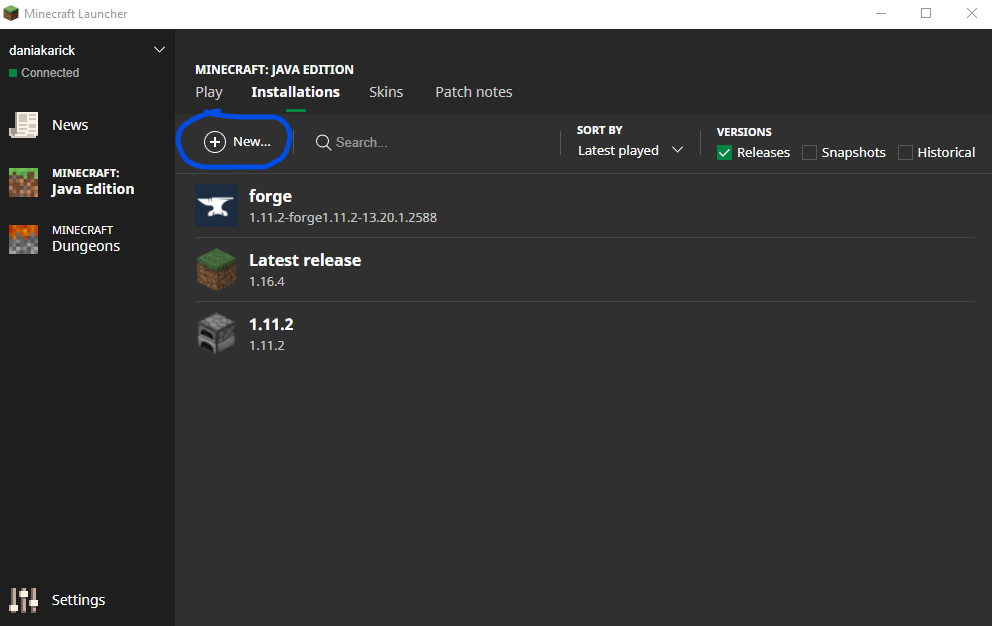
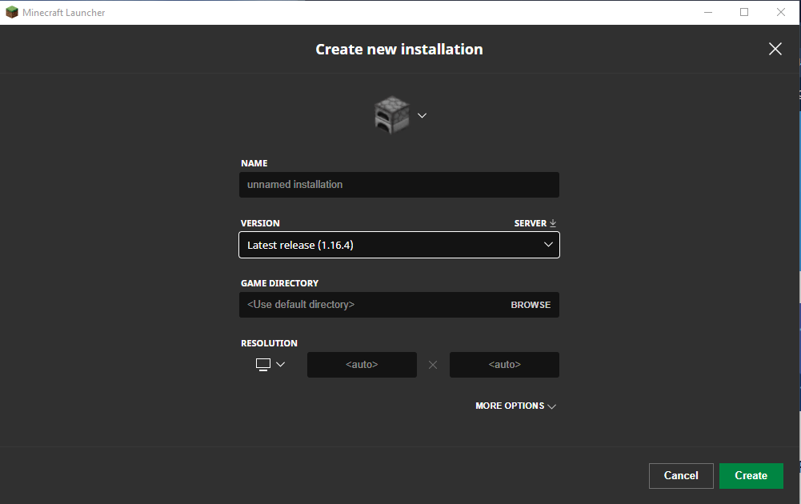

# Masters-Dissertation

Masters Dissertation solution. Focusing on Deep Reinforcement Learning in Minecraft. 

Utilising the Malmo platform with Marlo and MineRL API extensions.

The solution runs as a Docker Image for most of the application. A paid version of Minecraft Java Edition is **still** required for the full app to run however.

# Requirements

-   [Minecraft Java](https://www.minecraft.net/en-us/store/minecraft-java-edition) Version 1.11.2
-   [Minecraft Forge](http://files.minecraftforge.net/) Version 1.11.2-13
-   [Docker](https://www.docker.com/)

Tutorial on how to specifically opt for the specific Minecraft versions is below. Accessing old mirrored versions is possible via the Minecraft Desktop Launcher. 

# Setup Instructions

**Minecraft**

After you have downloaded all the requirements above, clone this solution using:

```
git clone https://github.com/DaniellePotts93/Masters-Dissertation.git
```

Or download it as a zip.

To opt for a specific version of Minecraft, select 'Installations'.



From here, we can choose to add a new install:



From the dropdown, choose the correct version, and give it a name. The version will now install on your system



We repeat the same process to install the correct version of Minecraft Forge.

**Main Application**

From the root folder, run:

```
docker build -t Minecraft_RL .
```

Then:

```
docker run Minecraft_RL
```